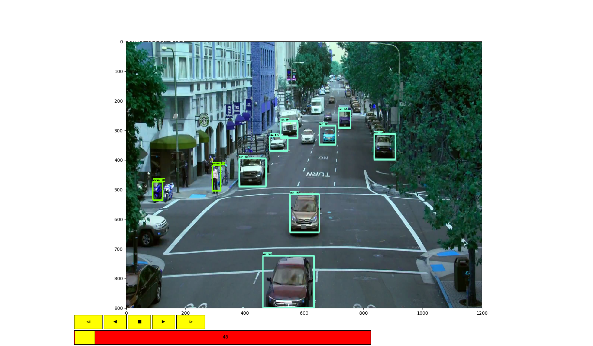

## Video Player 

The package contains a player object for viewing the performance of different object detection models on video files. The player provids forward, backward buttons and a clickable slider as shown in the image.

**How to use**
1. Download the tensorflow [object detection module](https://github.com/tensorflow/models/tree/master/research/object_detection)
2. Set the variable 'PATH_TO_OBJECT_DETECTION'
3. Download or train your desired tensorflow model
4. Run the following:

    video_file = './data/city.mp4'
    vod = VideoObjectDetection(detection_graph)
    vod.play(video_file)

**Attention:**
The code for loading a tf model is taken from pythonprogramming.net channel. Specifically, [here](https://pythonprogramming.net/video-tensorflow-object-detection-api-tutorial/). However, 'VideoHandling' package is not about how to load a model as is aimed at building a player which simplifies analyzing the performance of the trained models on video data.